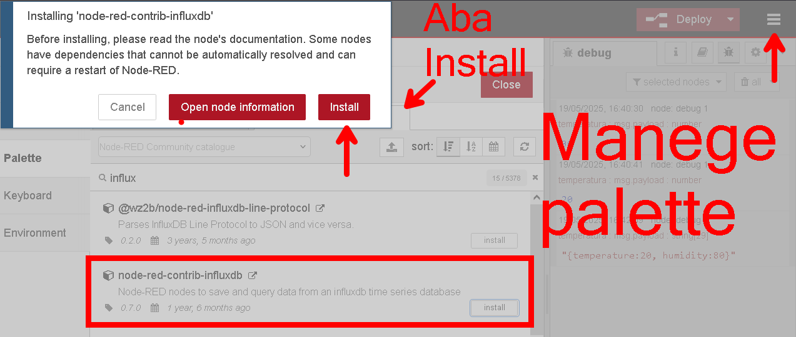

# Aula 07: MING

A stack **MING** combina de forma eficaz quatro tecnologias open-source para melhorar a gestão de dados na IIoT (Internet Industrial das Coisas). Cada componente é essencial para a coleta, o armazenamento, a análise e a visualização bem-sucedidas do volume crescente de dados gerados por dispositivos conectados. A stack MING foi criada pela equipe da **Balena** e ganhou popularidade por volta de 2019.

Nos primeiros dias da web, os desenvolvedores precisavam de um método confiável e econômico para implantar e executar aplicações web em um servidor. A stack **LAMP** (Linux, Apache, MySQL, PHP/Python/Perl) resolveu esse problema ao oferecer soluções gratuitas e de código aberto, já pré-configuradas com todos os componentes necessários. Essa abordagem era econômica, flexível e escalável.

A stack **MING**, assim como a LAMP, responde a um problema semelhante. O enorme volume de dados em tempo real gerado pela IIoT exige um sistema capaz de coletar, armazenar, analisar e visualizar esses dados de forma eficiente. As stacks tradicionais de desenvolvimento web, como a LAMP, não foram projetadas para lidar com processamento de dados em tempo real, o que torna a MING uma solução relevante e necessária.


---

## MQTT (Message Queue Telemetry Transport)

O **MQTT** é o protocolo padrão para comunicações em IoT. Esse protocolo de mensagens leve permite a comunicação entre dispositivos com recursos limitados. Imagine o MQTT como uma linguagem simples e eficiente que permite que dispositivos publiquem dados (como leituras de sensores) em um local central. O foco do MQTT em mensagens pequenas e uso reduzido de banda o torna ideal para dispositivos IoT com restrições de recursos.


https://mqtt.org/getting-started/

## InfluxDB

O **InfluxDB** é um banco de dados de séries temporais otimizado para armazenar e recuperar grandes volumes de dados capturados ao longo do tempo. Pense no InfluxDB como um arquivo especializado, projetado para lidar com o fluxo constante de dados gerado por dispositivos IoT. Ele se destaca no tratamento de conjuntos de dados que mudam rapidamente, permitindo uma recuperação e análise ágeis.


https://www.influxdata.com/index/

## Node-RED

O **Node-RED** é uma ferramenta de programação visual que permite aos usuários construir fluxos de dados sem escrever códigos complexos. Imagine o Node-RED como uma interface de arrastar e soltar, onde você pode conectar módulos pré-construídos para criar fluxos de processamento de dados. Essa ferramenta amigável simplifica o processo de filtrar, transformar e analisar dados, tornando-o acessível mesmo para quem não tem uma formação forte em programação.


https://nodered.org/docs/getting-started/

## Grafana

O **Grafana** é uma plataforma open source para criação de painéis interativos e visualizações personalizadas. Ele permite criar gráficos, painéis e outras visualizações que facilitam a exploração e a compreensão de conjuntos de dados complexos.


https://grafana.com/docs/grafana/latest/getting-started/build-first-dashboard/

---

<aside>


Trabalhando juntas, essas quatro tecnologias dentro da stack **MING** oferecem uma solução completa para gerenciar e extrair valor dos dados em tempo real gerados por aplicações IoT.

</aside>

---

# Tutorial: Desenvolvendo uma aplicação IIoT com a stack MING e Docker Compose

## Objetivo

Este tutorial apresenta o passo a passo para configurar uma aplicação IIoT utilizando a stack MING (MQTT, InfluxDB, Node-RED e Grafana) com Docker Compose. Além disso, mostraremos como conectar um ESP32 à aplicação para envio de dados.

> Observação: A porta 1883 já está em uso por outra aplicação (Thingsboard). Usaremos a porta 1884 para o broker MQTT.
> 

## Requisitos

- Docker
- Docker Compose
- Editor de texto (Visual Studio Code recomendado)
- ESP32 com suporte a Wi-Fi

---

## 1. Estrutura do Projeto

Crie um diretório para o projeto:

```powershell
mkdir iot-ming-stack
cd iot-ming-stack
```

## 2. Configurando o Mosquitto

Crie a pasta `mosquitto/config` e adicione o arquivo `mosquitto.conf`:

```powershell
mkdir -p mosquitto/config 
mkdir -p mosquitto/data 
mkdir -p mosquitto/log
```

Arquivo: `mosquitto/config/mosquitto.conf`

```
persistence true
persistence_location /mosquitto/data/
log_dest file /mosquitto/log/mosquitto.log
listener 1883
allow_anonymous true
```

## 3. Configurando o Docker Compose

Crie um arquivo chamado `docker-compose.yml`:

```yaml
services:

  mosquitto:
    image: eclipse-mosquitto
    ports:
      - "1884:1883" # Porta alterada para evitar conflito
      - "9001:9001"
    volumes:
      - ./mosquitto/config:/mosquitto/config
      - ./mosquitto/data:/mosquitto/data
      - ./mosquitto/log:/mosquitto/log
    networks:
      - ming-network

  influxdb:
    image: influxdb:2.0
    ports:
      - "8086:8086"
    volumes:
      - influxdb-data:/var/lib/influxdb2
      - influxdb-config:/etc/influxdb2
    environment:
      - INFLUXDB_HTTP_AUTH_ENABLED=true
    networks:
      - ming-network

  nodered:
    image: nodered/node-red
    ports:
      - "1880:1880"
    volumes:
      - nodered-data:/data
    depends_on:
      - mosquitto
      - influxdb
    networks:
      - ming-network

  grafana:
    image: grafana/grafana
    ports:
      - "3000:3000"
    volumes:
      - grafana-data:/var/lib/grafana
    depends_on:
      - influxdb
    networks:
      - ming-network

volumes:
  influxdb-data:
  influxdb-config:
  nodered-data:
  grafana-data:

networks:
  ming-network:
```

O arquivo `docker-compose.yml` define quatro serviços principais, cada um rodando em seu próprio container, com volumes persistentes e uma rede compartilhada chamada `ming-network` para garantir que todos os serviços possam se comunicar entre si.

O primeiro serviço definido é o **Mosquitto**, que utiliza a imagem oficial `eclipse-mosquitto`. A porta interna padrão do Mosquitto, `1883`, foi mapeada para a porta `1884` do host para evitar conflitos com outras possíveis instâncias. Também é exposta a porta `9001`, geralmente utilizada para conexões WebSocket. Três volumes são montados: um para o diretório de configuração (`./mosquitto/config`), outro para os dados (`./mosquitto/data`) e outro para os logs (`./mosquitto/log`). Isso permite personalizar o comportamento do Mosquitto e preservar dados entre reinicializações. O serviço está conectado à rede `ming-network`.

O segundo serviço é o **InfluxDB**, utilizando a imagem `influxdb:2.0`. Ele expõe a porta `8086` para acesso à interface HTTP da base de dados. Um volume nomeado (`influxdb-data`) é usado para armazenar os dados da base de forma persistente. Algumas variáveis de ambiente são definidas para configurar o banco com um nome (`iot`), ativar a autenticação HTTP e criar um usuário administrador (`admin`) com senha (`admin123`). Esse serviço também está ligado à rede `ming-network`.

O terceiro serviço é o **Node-RED**, baseado na imagem `nodered/node-red`, que fornece um ambiente visual para programar fluxos de automação. A porta `1880` é exposta para permitir o acesso ao painel web. Os dados do Node-RED são armazenados no volume nomeado `nodered-data`. O serviço depende do Mosquitto e do InfluxDB, garantindo que esses dois serviços estejam prontos antes que o Node-RED seja iniciado. Ele também participa da mesma rede compartilhada.

O quarto serviço é o **Grafana**, que roda a imagem `grafana/grafana`. A porta `3000` é exposta para permitir acesso ao painel de visualização de dados. O volume `grafana-data` é usado para manter os dados de configuração e dashboards da interface mesmo após reinicializações. O Grafana depende do InfluxDB e está igualmente conectado à rede `ming-network`.

Por fim, são declarados três volumes nomeados (`influxdb-data`, `nodered-data` e `grafana-data`) para armazenar dados persistentes de cada serviço. A seção `networks` define uma rede personalizada chamada `ming-network`, que é compartilhada entre todos os serviços para permitir comunicação direta usando os nomes dos serviços como hostname (por exemplo, o Node-RED pode acessar o Mosquitto usando `mosquitto:1883`).

## 4. Executando a Stack

No diretório raiz do projeto:

```powershell
docker compose up -d
```

Verifique se os serviços estão em execução:

```powershell
docker ps
```

## 5. Conectando MQTT Mosquitto com o Node-RED

Acesse: [http://localhost:1880](http://localhost:1880/)

1. Adicione um node MQTT input e configure:
    - Server: `mqtt://mosquitto:1883` (container do serviço mqtt + porta interna)
    - Topic: `esp32/temperature`
2. Conecte esse node a um node `debug` para testar.
3. Teste a conexão com o serviço MQTT (mosquitto):
    - Faça `Deploy` no NodeRed e entre no modo Debug.
    - Abra o prompt de comando do windows e execute o seguinte comando:
        
        ```powershell
        mosquitto_pub -h localhost -p 1884 -t "esp32/temperature" -m 30
        ```
        
        Para executar de dentro do container `mosquitto` :
        
        ```powershell
        docker exec -it iot-ming-stack-mosquitto-1 mosquitto_pub -h mosquitto -p 1883 -t "esp32/temperature" -m 30 -q 1
        ```
        

## 6. Conectando o Node Red com o InfluxDB

### 6.1. No InfluxDB:

1. Acesse o InfluxDB em: [http://localhost:8086](http://localhost:8086/)
    - username: `admin`
    - password: `admin123`
2. Click em *Get Started* e faça as seguintes configurações:
    - Crie uma organização com o seguinte nome: `SENAI`
    - Crie um bucket com o seguinte nome: `iot`
    - Copie o API Token gerado no final da configuração.

### 6.2. No Node Red:

1. Instale os seguintes nós adicionais no Node Red:
    - `node-red-contrib-influxdb`
    
    Acesse `Manage palette` → `Install` e procure por `influxdb` 
    
    
    
2. Adicione o nó `influxdb out` e realize as seguintes configurações:
    - Em Server, clique em `+` e adicione:
        
        
        - Versão: `2.0`
        - URL: `http://influxdb:8086` (Nome do container)
        - Token: token gerado no InfluxDB
        
        
        
    - Volte para a tela de configuração principal e adicione:
        
        
        - Organization: `SENAI`
        - Bucket: `iot`
        - Measurement: `esp32`
        
        
        

### 6.3. Teste a Conexão Mosquitto → Node Red → InfluxDB:

1. Faça `deploy` da nova configuração do Node Red:
    
    
    
2. Execute novamente o comando `mosquitto_pub` conforme item 5.3: na tela de `debub` do Node Red você deve receber algo assim:
    
    
    
3. Para verificar se dado chegou no InfluxDB, vá até o serviço, selecione o bucket `iot` e realize os seguintes filtros: `iot` → `esp32` → `value`. Depois click em `submit`. 
    
    
    
4. Clique em Script Editor e salve o código gerado para utilizarmos na próxima etapa:
    
    
    

## 7. Configurando o Grafana

### 7.1. Conectando InfluxDB com Grafana

Acesse: [http://localhost:3000](http://localhost:3000/)

1. Login padrão:
    - Usuário: `admin`
    - Senha: `admin`
2. Adicione um novo `Data Source`:
    - Tipo: InfluxDB
    - Query Language: `Flux`
    - URL: `http://influxdb:8086`
    - Organization: `SENAI`
    - Token: Token do InfluxDB (InfluxDB → Data → Token)
    - Default Bucket: `iot`


### 7.2. Criando um dashboard

1. No Grafana, vá até dashboard e clique em `Add Visualization` .
2. Selecione o Data Souce configurado no passo anterior.
3. No campo inferior da tela, cole o código obtido no item 6.3.4, dê um nome ao painel e salve o dashboard.
    
    
    

---

# Tarefa:

Utilize os conhecimentos adquiridos nas aulas anteriores e configure um ESP32 munido de um sensor de temperatura LM35 (ou DHT11) para enviar dados reais à stack IoT MING que acabamos de configurar.

---

# Remover Recursos:

Ao final da atividade se desejar para a aplicação você pode utilizar as seguintes opções:

1. **Apenas parar a execução dos containers mas sem perder dados e configurações:**
    
    ```powershell
    docker compose down
    ```
    
    - **Para:** containers.
    - **Remove:** containers, mas **mantém volumes e imagens**.
    - **Mantém:** dados persistentes (volumes nomeados).
2. Parar a execução dos containers e remover seus dados e configurações:
    
    ```powershell
    docker compose down -v
    ```
    
    - **Para:** containers.
    - **Remove:** containers **e os volumes anônimos ou nomeados** associados.
    - **Mantém:** imagens.
3. Parar containers, remover seus dados, configurações e também as imagens:
    
    ```powershell
    docker compose down --rmi all -v
    ```
    
    - **Para:** containers.
    - **Remove:** containers, **volumes** e **imagens** usadas.
    - **Resultado:** o ambiente volta ao estado "zerado".

---

## 8. Executar o script de envio de temperatura

Este projeto inclui um script para enviar valores simulados de temperatura para o broker MQTT usando Docker e Mosquitto.

### Script:

```bash
#!/bin/bash

# Intervalo de temperatura
min_temp=20
max_temp=50

while true; do
  # Gera temperatura aleatória entre min_temp e max_temp
  temp=$(( RANDOM % (max_temp - min_temp + 1) + min_temp ))
  
  echo "Enviando temperatura: $temp"
  
  docker exec iotmingstack-mosquitto-1 \
    mosquitto_pub -h mosquitto -p 1883 -t "esp32/temperature" -m "$temp" -q 1

  sleep 15
done

```

### Como executar:

1. Certifique-se de que o container iotmingstack-mosquitto-1 está em execução.

2. Execute o script:
```bash
./temperature.sh
```

O script enviará, a cada 15 segundos, uma temperatura aleatória entre 20ºC e 50ºC para o tópico MQTT: esp32/temperature no broker *Mosquitto*

# Referências:

https://www.influxdata.com/blog/-ming-stack-introduction-influxdb/
https://docs.influxdata.com/influxdb/v2/get-started/
https://grafana.com/docs/grafana/latest/
https://nodered.org/docs/

https://mosquitto.org/documentation/